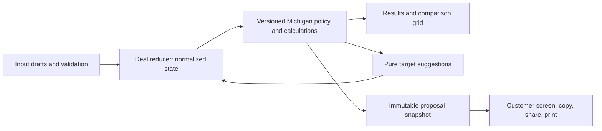

# Operating and release handoff

## Purpose and ownership

Payment Desk supports an estimate conversation. It does not approve credit, choose lender eligibility, generate a binding contract, save customer records, or synchronize with a DMS/CRM. Preserve that scope unless a separate requirement defines data access, retention, and approved financial integrations.

Before handing operation to another company, record actual people and business accounts for these roles. No unconfirmed owner is assigned here.

| Role | Responsibility |
| --- | --- |
| Dealership product owner | Supported transactions, proposal wording, staff training, and pilot acceptance |
| Dealership policy owner | CRV definition, document-fee basis, product taxability, fee exceptions, lender/DMS reference examples, and annual review |
| Technical maintainer | Repository access, release checks, dependency updates, rollback, support triage, and deployment settings |
| Business account owner | Repository/domain ownership, approved brand assets and commercial rights, recovery access, and departing-staff access removal |

The existing repository is under a personal GitHub account. Agree on business ownership and recovery access before transferring responsibility. Do not assume code publication grants rights to dealership branding or changes who owns the software.

## Architecture and change boundaries

- `Fields.jsx`, `inputValidation.js`, and `ValidationContext.jsx` separate incomplete/invalid text from committed figures. Invalid drafts preserve the last valid estimate and block proposal actions.
- `dealState.js` owns deal changes, rate/grid synchronization, view transitions, reset, and one-step undo expiry. Use reducer actions rather than direct component state patches for financial changes.
- `calculations.js` uses cent-based money and consistent two-decimal APR normalization. `suggestions.js` evaluates the same normalized patch it presents and applies.
- `policy.js` records rule versions, dates, sources, and supported scope. Extend its review window only after checking the applicable fees/taxes and updating regression fixtures.
- `proposal.js` creates the reference, date/version, itemized groups, selected figures, and qualifications used for customer export. A generic calculator link opens a fresh deal; it is not a saved proposal.
- `release.js` and the Vite build identify the app version and source revision. Include both, the estimate reference/date, browser, and reproduction steps in a defect report. Avoid customer names or unnecessary financial data in diagnostic services.

Keep this small React/Vite application unless agreed requirements justify a server. A full TypeScript migration is optional; the implemented JSDoc/domain boundaries and executable tests are the current maintenance contract.

## Policy approval and scope

The policy code contains primary Michigan Treasury, SOS, and DIFS source links. The current fee review window covers 2026. Scheduled later-year trade credits are available for inspection, but policy expiry prevents unqualified proposal export until review.

The documentary fee uses selling price as a conservative estimate basis: the lower of $280 or 5%, rounded down to cents, on both purchase modes. This does not certify the dealership's exact statutory cash-price basis. Confirm the approved DMS/contract method with the policy owner before relying on it for low-price transactions.

Confirm the meaning, amount, and taxability of CRV; the correct treatment of Service Contract, Gap, and each Other product; and registration/title exceptions. Other positive charges require a name and an explicit Taxable or Not taxable selection before proposal export. Mathematical price/trade/rate suggestions are not manager authorization, product consent, or lender approval.

Regular monthly amortization excludes odd first periods, daily interest timing, lender-specific charges, and a reconciled final installment. Reported interest/total payments remain analytical estimates. Reconcile representative lender/DMS cases before widening use. Manufacturer rebates need their own after-tax treatment if implemented; never subtract one from the taxable selling price merely to fit the current model.

## Local checks and release

Use the README setup commands. The release command builds first, then tests the production output in desktop Chromium, mobile Chromium, and desktop WebKit. Browser failures retain screenshots/traces; CI retains report artifacts for 14 days. Use synthetic figures in tests.

Both workflows run `npm run check:release`. CI runs on PRs and pushes, including main. The Pages build validates before uploading `dist`; only the deploy job can publish and request OIDC credentials. Build permissions are read-only; action references are pinned to reviewed commit SHAs. Manual dispatch from a branch other than main cannot deploy.

Repository settings are separate from workflow files and are **not enabled by this documentation**. In GitHub:

1. Create a main-branch ruleset requiring a PR and the **Release checks** job from the CI workflow. Select the check after its first successful run; do not substitute a Pages deploy status for validation.
2. Require review for policy/calculation and workflow changes. Document who may use an emergency bypass and require a follow-up review.
3. Keep the `github-pages` environment limited to main. Confirm Pages uses GitHub Actions. Restrict account access to maintainers; retain recovery access for the business owner.
4. Review Dependabot PRs for npm and Actions. Confirm the pinned Action SHA and version comment remain aligned, then run the same release checks.

A normal release is a reviewed PR merged to main after validation and the applicable acceptance checks. After deployment, verify the displayed build ID, a known estimate, mobile navigation, and one customer export. Record the release URL/run, commit, validation evidence, and any remaining business limitations. No code in this guide automatically performs a deployment or repository-settings change.

## Rollback and support

Identify the last accepted release from its commit and deployment run. Make a new branch from current main, revert the problematic change through a reviewed PR (or restore the affected files from the accepted commit into a new reviewable change), run `check:release`, and merge normally. Do not force-push or erase release history. Recheck the published build and known estimate after rollback.

For an urgent failure, preserve its build ID and reproducible synthetic case, then stop relying on the affected calculator workflow and use the dealership's approved systems while the fix is reviewed. The browser error boundary can reset a broken deal but is not a recovery store. An agreed owner should receive deployment failures and a simple availability/smoke check; this change does not configure an external monitoring account or recurring automation.

The app has no persistence or offline worker. The refresh/close guard cannot guarantee recovery, especially on mobile. It makes no external font request and has no analytics collector. If saved proposals, offline operation, customer identities, or restricted access are later added, explicitly choose their retention, access, shared-device reset, and support model first.
